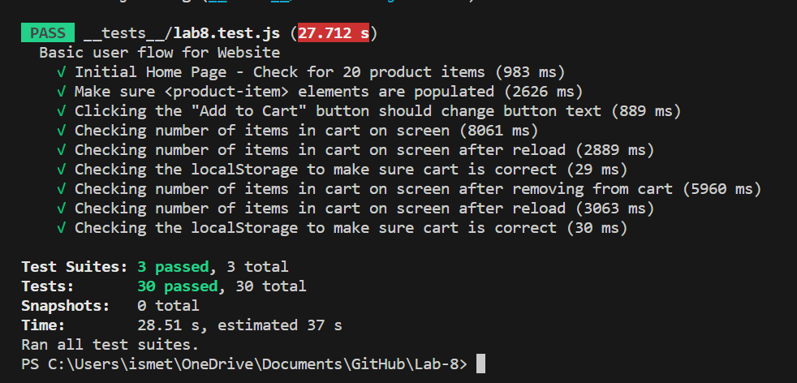

# Lab 8

## Ezgi Bayraktaroglu

# Checking Understanding

1. I think the best way to do automated tests for the Recipe project development pipeline would be to do them within a Github actions whenever code is pushed. This is because doing it manually before pushing the code is basically the same as the automated tests, but it takes more effort on your part, and you could forget to do it. Also, running them after all development is completed is bad because then it will be very hard to debug after you've written a bunch of code and the error(s) could be anywhere.
2. I would not use end to end testing to check if a function is returning the correct output if it only depends on the inputs of the function or no outside information, because it is not connected to anything outside itself, so it could be easily tested on its own without running the entire program. But if it does use something like local storage or other values outside itself, then you would need to use end to end testing in order to test it.
3. I would not use a unit test to test a 'message' feature of a messaging application, because you want to be able to see the entire process of the message being written and sent and comfirm whether is gets sent and received, and I doubt you can do that without end-to-end testing.
4. I would use unit testing to test the "max message length" feature of a messaging application, because it only tests one aspect of the program, and you don't need to connect it to the other parts of the program to test whether it accepts a message longer than a specific length.

